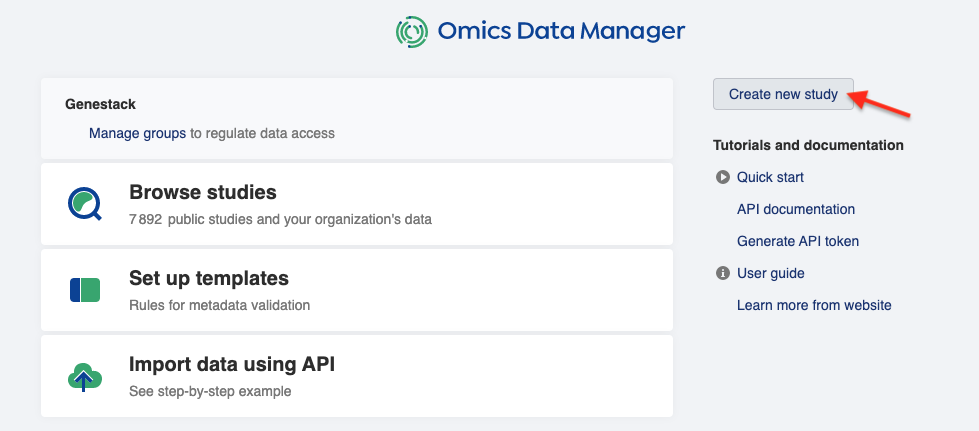
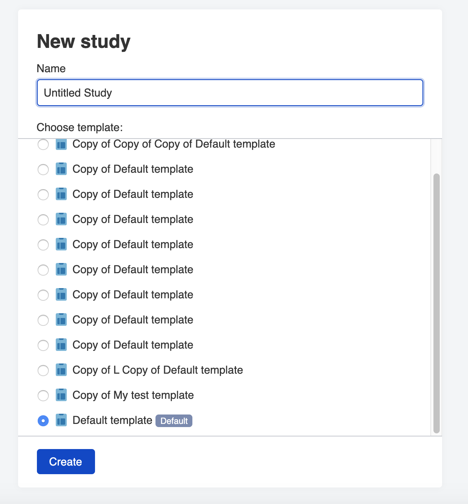

Create Study
++++++++++++

To create new study go to Dashboard and click the **New study** button.

THis will open **Metadata Editor** application where you will be suggested to name the new study and
change Default template if necessary.

Hover over a template name and click **Explore** to open it in the Template Editor application.

..image:: images/template-editor.png