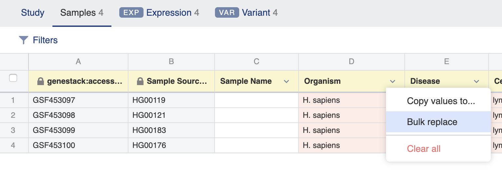
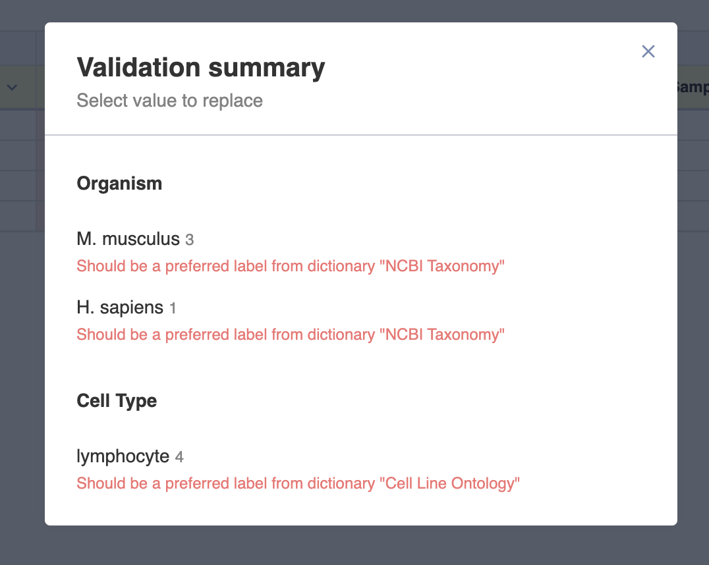
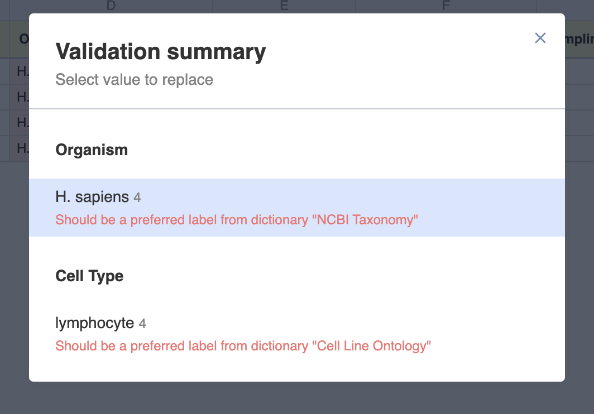
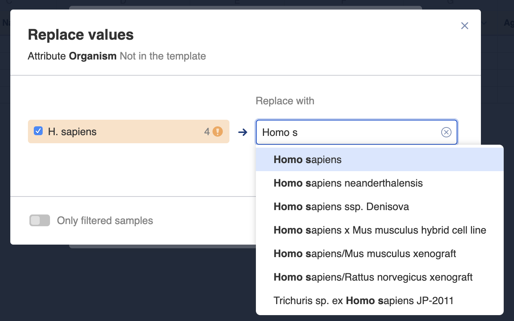
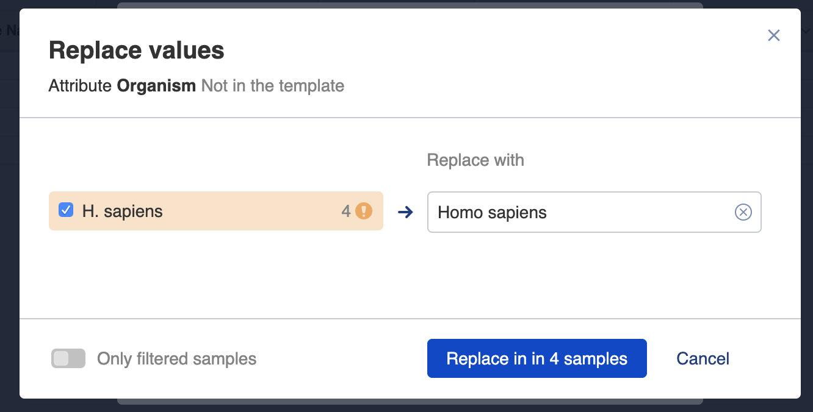
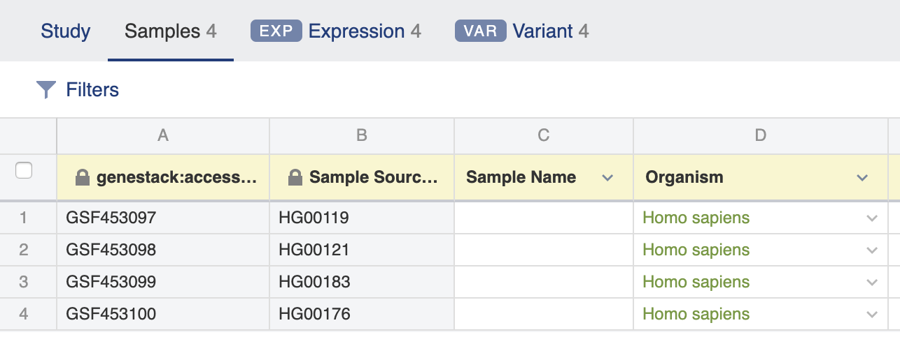
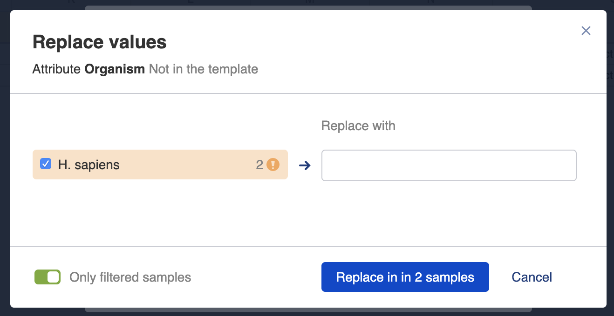
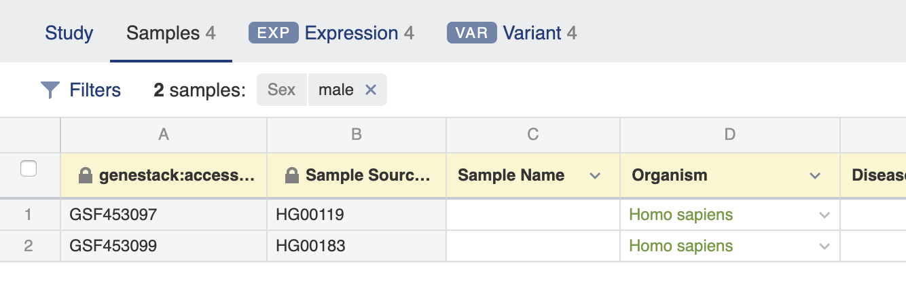

Curator Guide
+++++++++++++

This guide is for users who have uploaded data to ODM and now wish to curate it by adding or changing metadata.

Dashboard
---------

From the Dashboard where you first log in, select "Browse studies" to enter the Study Browser:

.. image:: images/dashboard_studybrowser.png
   :scale: 35 %
   :align: center

Study Browser
-------------

In the Study Browser you can view studies you've uploaded easily by checking the "Owned by me" option. By clicking on the study title ("New Study" by default) you can enter the Metadata Editor application which allows you to make changes to the study and associated data.

.. image:: images/Study-browser-new-study.png
   :scale: 55 %
   :align: center

Metadata Editor
---------------

.. image:: images/Study-metainfo-editor-new-study.png
   :scale: 40 %
   :align: center

The Metadata Editor application is where you can make changes to the metadata of Study, Samples and any processed/experimental metadata.

To rename the study click on the "New Study" link at the top of the page and select "Rename". Type in the new name and click the blue "Rename" button.

.. image:: images/New-study-rename1.png
   :scale: 40 %
   :align: center

.. image:: images/New-study-rename2.png
   :scale: 70 %
   :align: center

Validation
----------

Metadata fields are checked against a specific template (given above the Study name), and if required fields are missing
or have incorrect values as determined by the template then an "Invalid metadata" flag is shown, together with a red
background for the field which is invalid. Templates contain specific rules for each of the Study, Samples and
processed/experimental metadata tabs.

The specific template that applies for a dataset can be changed by clicking the **Choose another..** button.

.. image:: images/template-selection.png
   :scale: 35 %
   :align: center

To correct metadata you can use **bulk replace** function. If some metadata fields are filled in incorrectly, for example a specified value has some typos or metadata terms
don't match the template, you will see the **Invalid metadata** link in the upper right corner.

.. image:: images/invalid-metadata.png
   :scale: 30 %
   :align: center

Another option to aid bul replace is to click the name a metadata filed that include incorrect values
and select "Bulk replace" in the drop down list.

Click on the Invalid metadata link or "Bulk replace" option opens the **Validation Summary** pop-up window where you could find metadata that should be corrected.

Then, select a value that should be replaced in metadata of samples.

The **Replace values** window will open allowing you to type in a correct value.
If the field is controlled by a dictionary then auto-complete suggestions will also appear
so that you can match the dictionary terms.

Click **Replace in...** button to apply the changes.

Immediately the incorrect metadata values will be replaced with the new terms.

If there are some filters applied (for example, "Sex" - "male"), you can replace values only for filtered samples.

As a result, valkus for only filtered samples will be changed.

Correcting metadata
===================

To correct metadata, click the field you wish to change. If the input is text you can type a new value in directly.
When all the fields in a tab have been corrected the Invalid metadata flag will be removed an instead a green
"Metadata is valid" flag will show.

.. image:: images/corrected-metadata.png
   :scale: 80 %
   :align: center

Fields which have dictionaries specified for them in the template, for example, Organism, allow you to click the
triangle in order to select a term from a list given by the dictionary, or you can begin to type and the window
will suggest auto-completions for you. Terms matching dictionary terms will turn green.

.. image:: images/auto-complete.png
   :scale: 50 %
   :align: center

Values in the samples table cells can be propagated by dragging the bottom-right corner of a cell.

.. image:: images/cell-drag.png
   :scale: 50 %
   :align: center

.. image:: images/cell-drag2.png
   :scale: 50 %
   :align: center

.. The summary table (seen by clicking the "Show summary" button) you can hover over any metadata row and a "Replace..." link will appear.

.. .. image:: images/bulk-replace1.png
   :scale: 75 %
   :align: center
