Curator Guide
+++++++++++++

This guide is for users who have uploaded data to ODM and now wish to curate it by adding or changing metadata.

Dashboard
---------

From the Dashboard where you first log in, select "Browse studies" to enter the Study Browser:

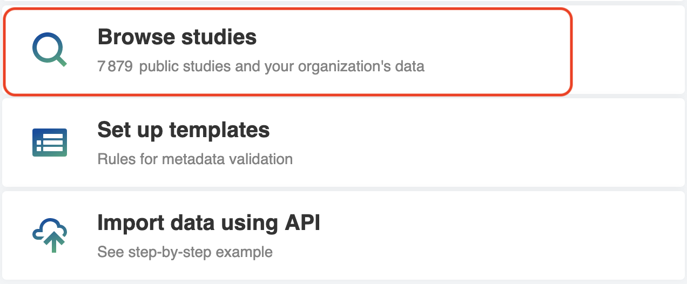

Study Browser
-------------

In the Study Browser you can view studies you've uploaded easily by checking the "Owned by me" option. By clicking on the study title ("New Study" by default) you can enter the Metadata Editor application which allows you to make changes to the study and associated data.

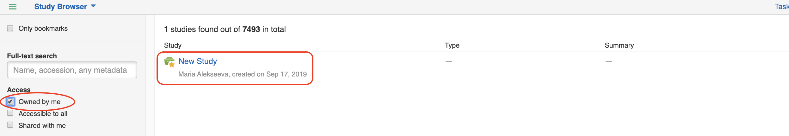

Metadata Editor
---------------

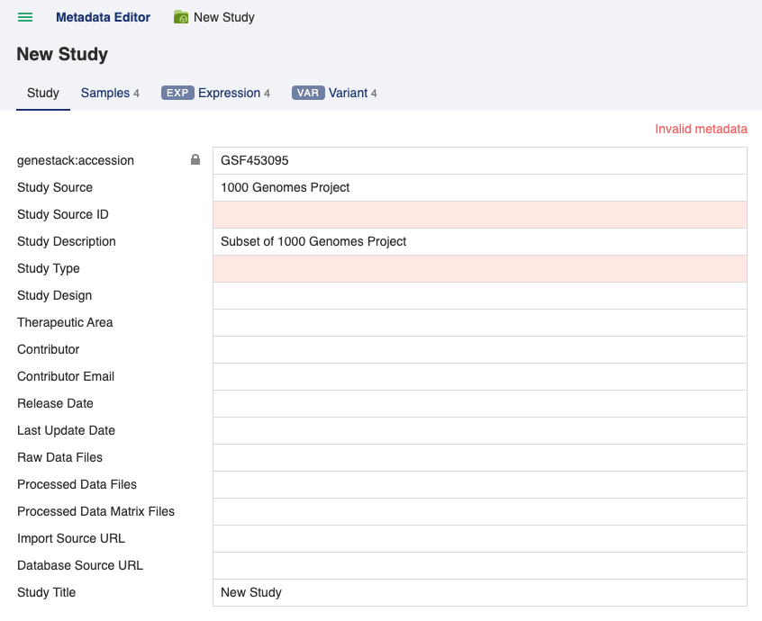

The Metadata Editor application is where you can make changes to the metadata of Study, Samples and any processed/experimental metadata.

To rename the study click on the "New Study" link at the top of the page and select "rename". Type in the new name and click the blue "Rename" button.

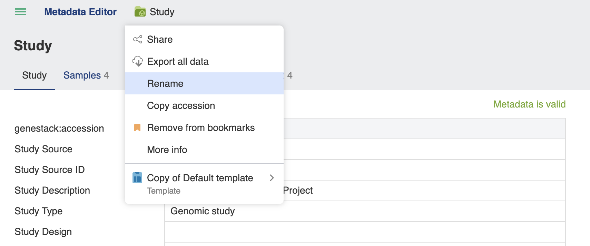

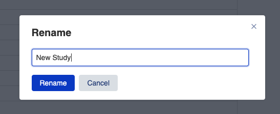

Validation
----------

Metadata fields are checked against a specific template (given above the Study name), and if required fields are missing or have incorrect values as determined by the template then an "Invalid metadata" flag is shown, together with a red background for the field which is invalid. Templates contain specific rules for each of the Study, Samples and processed/experimental metadata tabs.

The specific template that applies for a dataset can be changed by clicking the "Choose another.." button.

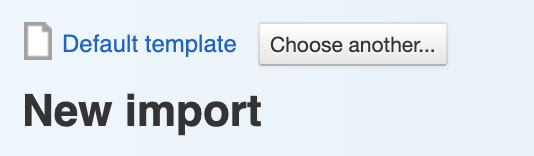

Samples summary
===============

The samples tab has a special "Show summary" button, which summarises the metadata for the samples that are present. This summary also highlights metadata terms that don't match the template.

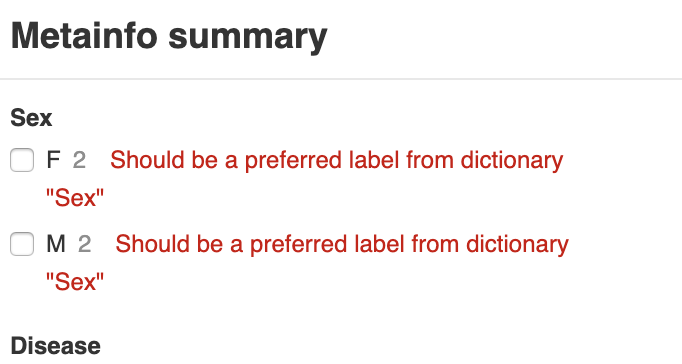

Correcting metadata
===================

To correct metadata, click the field you wish to change. If the input is text you can type a new value in directly. When all the fields in a tab have been corrected the Invalid metadata flag will be removed an instead a green "Metadata is valid" flag will show.

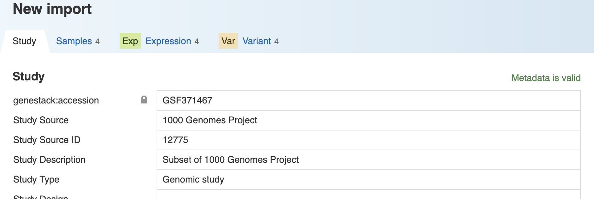

Fields which have dictionaries specified for them in the template, for example, Organism, allow you to click the triangle in order to select a term from a list given by the dictionary, or you can begin to type and the window will suggest auto-completions for you. Terms matching dictionary terms will turn green.

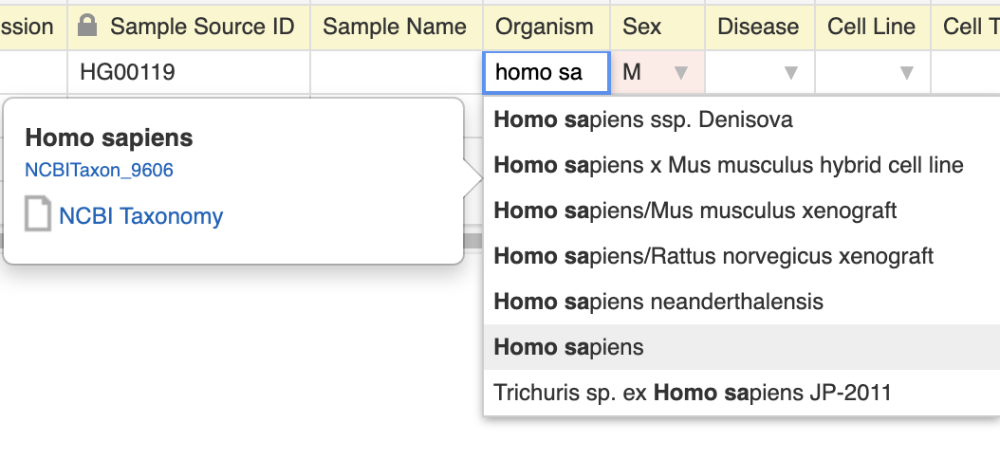

Bulk additions/replacements in the samples tab
==============================================

In the samples tab there are some functions to aid bulk changes.

Values in the samples table cells can be propagated by dragging the bottom-right corner of a cell.

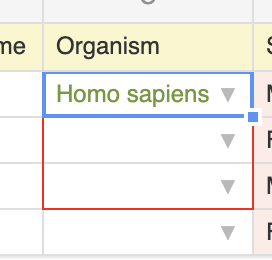

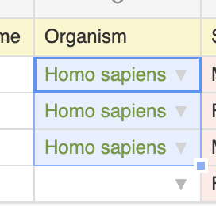

The summary table (seen by clicking the "Show summary" button) you can hover over any metadata row and a "Replace..." link will appear.

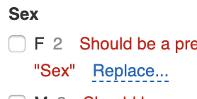

A window will open allowing you to type in a replacement value. If the field is controlled by a dictionary then auto-complete suggestions will also appear so that you can match the dictionary terms.

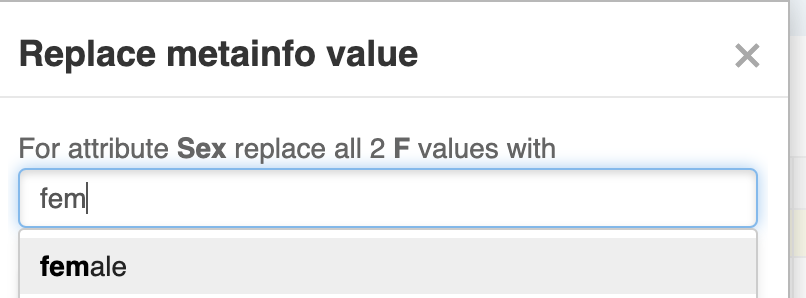

Click "OK" to apply the changes.