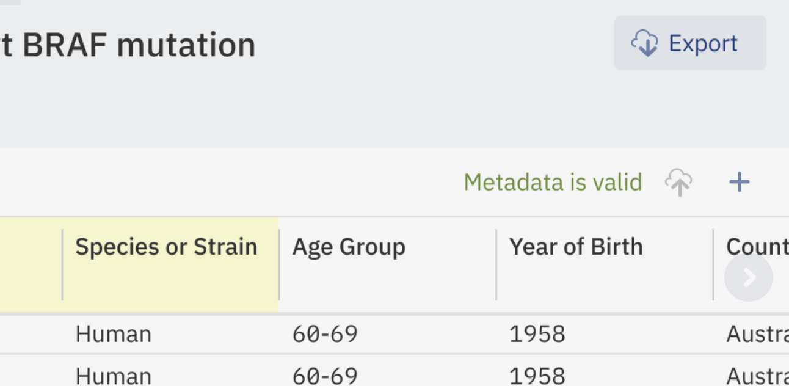

Exporting Data
++++++++++++++

To export data from a study either click the three buttons icon next to the study title from the Study Browser or click the study name in the Metadata editor and select **Export data**.

.. image:: images/export-data-menu.png
   :scale: 35 %
   :align: center

You can also click the Export button near the top right of any Metadata editor tab.

You will be taken to a page which generates an export link - this will download a compressed copy of all of the metadata and data associated with a study (including samples and omics metadata, and all versions of data files if more than one version has been imported). The archive will also contain a ReadMe file describing all the exported files. The link is pre-authenticated so anyone with the link will be able to download the study and associated data.

.. image:: images/export-data-link.png
   :align: center

Previous export links that have been generated will be listed at the bottom of the screen. These are archive versions and will reflect the data at the time the link was generated, not necessarily the latest version.

It is possible to export just one dataset of interest. For doing it navigate to a tab with analysis of interest and click on the “Export dataset” button. The data file with the corresponding metadata file and the description will be compressed into an archive and available via the link.

.. image:: images/add_data-button.png
   :scale: 35 %
   :align: center