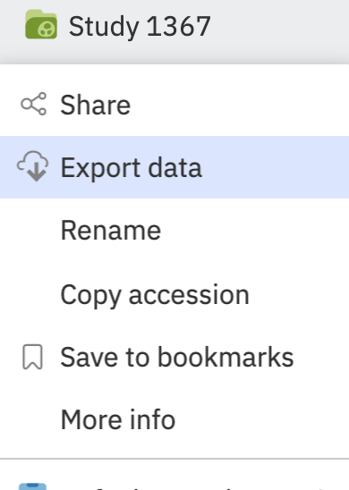
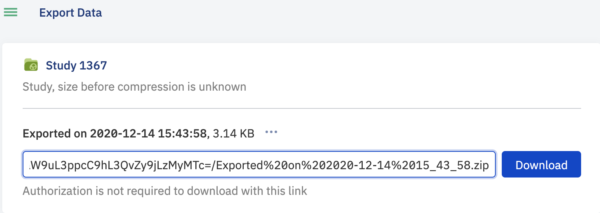

Exporting Data
++++++++++++++

To export data from a study either click the three buttons icon next to the study title from the Study Browser or click the study name in the Metadata editor and select **Export data**.

You will be taken to a page which generates an export link - this will download a compressed copy of all of the metadata and data associated with a study (including all versions of data files if more than one version has been imported). The link is pre-authenticated so anyone with the link will be able to download the study and associated data.

Previous export links that have been generated will be listed at the bottom of the screen. These are archive versions and will reflect the data at the time the link was generated, not necessarily the latest version.
