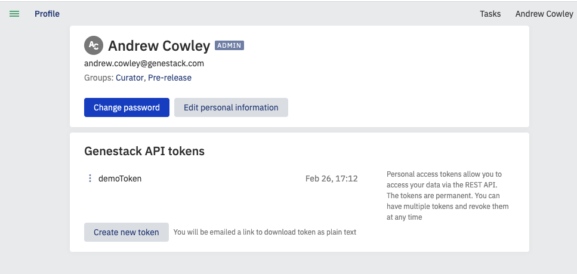

  .. _token-label:

Getting a Genestack API token
+++++++++++++++++++++++++++++

This page demonstrates how to get an API token for use in scripts or swagger pages that call Genestack APIs

Generate API token via Genestack software
-----------------------------------------

To obtain a token, sign in to the Genestack software (ie ODM) via a web browser, click on your email address in the top right and select "Profile"

.. image:: images/import_data_script_profile.png
   :scale: 50 %
   :align: center

Then click the "Create new token" button under API tokens:

You will then be emailed a link to download your token as plain text. The API token is permanent — there is no expiration date. However, you can revoke it at any time and have multiple tokens.
