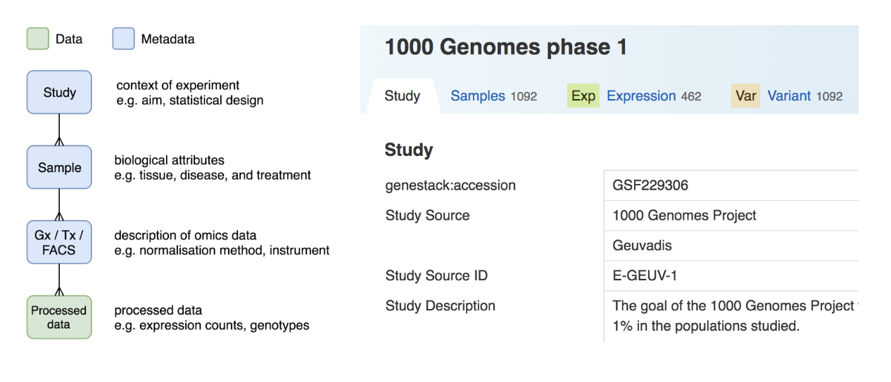
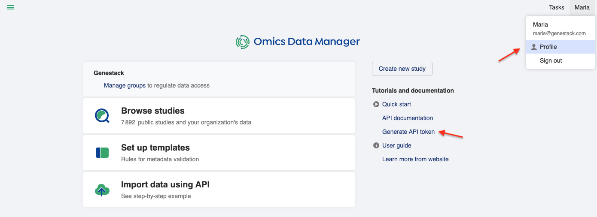
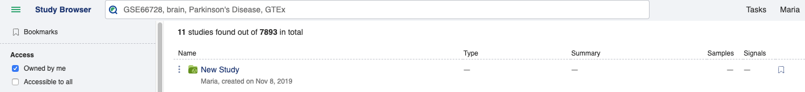
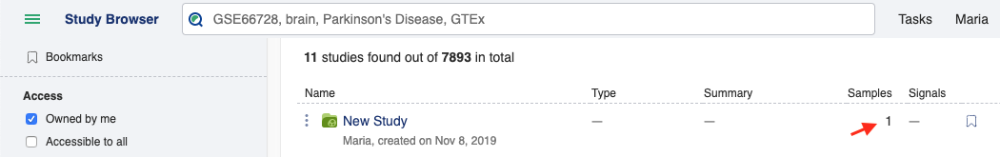
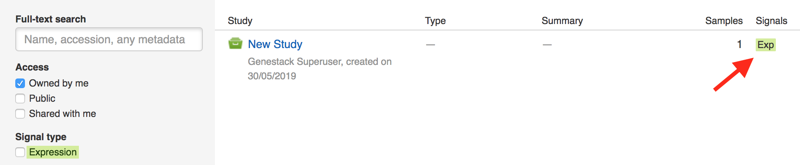
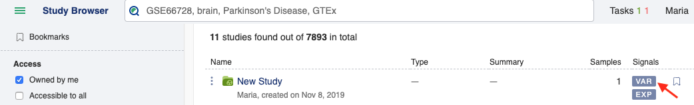
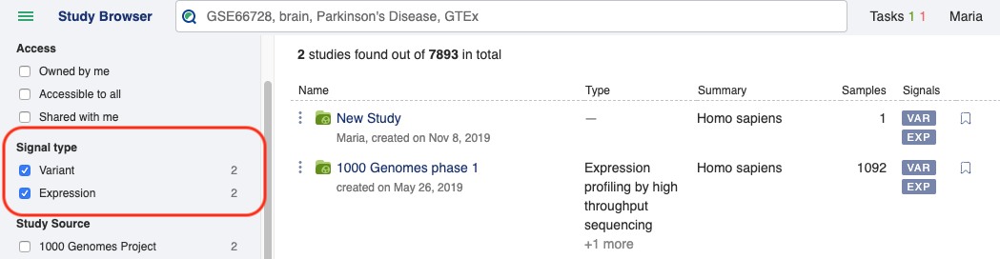

Import Data Using API
+++++++++++++++++++++

On this page, you will find a brief explanation about data import via APIs, followed by a step-by-step example that
you can try. Please note that you need to be a member of the curator group in ODM to be able to import and edit data
in ODM.

What can I import?
------------------

You can import studies, samples, and signals:

- *Study*: the context of an experiment, such as the aim and statistical design.

- *Sample*: the biological attributes of a sample, such as tissue, disease, and treatment.

- *Signal*: expression, variant, or flow cytometry data. You can import the metadata (e.g. genome version, normalization
  method, and the locations of raw/processed data in your storage) together with the processed data (e.g. expression counts, genotypes).

Once imported, studies, samples, and signal metadata will be queryable and editable from both the User Interface and
APIs, whilst the signal data will only queryable via APIs.

The accepted file formats will be described in the step-by-step example.

Can I capture the relationships between studies, samples, and signals?
----------------------------------------------------------------------

Importing data has two stages. First, you create studies, samples, and signals separately. Then, you can link them
together: a study can be linked to multiple samples and a sample can be linked to multi-omics signals. The **Sample Source ID** is used as the linking key, make sure that this is present and consistent in all the files you wish to link. The data model and how it looks in the User Interface is shown below:

Where can I import the data from?
---------------------------------

You should provide HTTP/FTP file links (which can include authentication credentials) to a storage that’s accessible
by ODM. File uploads from a local computer will be supported in a future release.

Step-by-step example
--------------------

As an example, we will import tiny data subsets from the 1000 Genomes Project, consisting of the following files:

- `Test_1000g.study.tsv`_, a tab-delimited file of the study attributes

.. _`Test_1000g.study.tsv`: https://s3.amazonaws.com/bio-test-data/odm/Test_1000g/Test_1000g.study.tsv

+----------------------+---------------------------------+------------------+
| Study Source         | Study Description               | Target Disease   |
+======================+=================================+==================+
| 1000 Genomes Project | Subset of 1000 Genomes Project  | Healthy          |
+----------------------+---------------------------------+------------------+

- `Test_1000g.samples.tsv`_, a tab-delimited file of sample attributes.

.. _`Test_1000g.samples.tsv`: https://s3.amazonaws.com/bio-test-data/odm/Test_1000g/Test_1000g.samples.tsv

+----------------------+------------------+--------------+-----+------------+
| Study Source         | Sample Source ID | Species      | Sex | Population |
+======================+==================+==============+=====+============+
| 1000 Genomes Project |     HG00119      | Homo sapiens |  M  | British    |
+----------------------+------------------+--------------+-----+------------+
| 1001 Genomes Project |     HG00121      | Homo sapiens |  F  | British    |
+----------------------+------------------+--------------+-----+------------+
| 1002 Genomes Project |     HG00183      | Homo sapiens |  M  | Finnish    |
+----------------------+------------------+--------------+-----+------------+
| 1003 Genomes Project |     HG00176      | Homo sapiens |  F  | Finnish    |
+----------------------+------------------+--------------+-----+------------+

- `Test_1000g.gct`_, a GCT_ file of expression data from multiple sequencing runs

.. _`Test_1000g.gct`: https://s3.amazonaws.com/bio-test-data/odm/Test_1000g/Test_1000g.gct
.. _GCT: https://software.broadinstitute.org/cancer/software/gsea/wiki/index.php/Data_formats#GCT:_Gene_Cluster_Text_file_format_.28.2A.gct.29

+-----------------+-------------+---------+---------+---------+---------+
| Name            | Description | HG00119 | HG00121 | HG00183 | HG00176 |
+=================+=============+=========+=========+=========+=========+
| ENSG00000077044 |             |  14.7   |   16.8  |  17.2   |  19.5   |
+-----------------+-------------+---------+---------+---------+---------+
| ENSG00000085982 |             |  4.2    |   7.1   |   5.5   |   6.8   |
+-----------------+-------------+---------+---------+---------+---------+

- `Test_1000g.gct.tsv`_, a tab-separated file that describes the expression data

.. _Test_1000g.gct.tsv: https://s3.amazonaws.com/bio-test-data/odm/Test_1000g/Test_1000g.gct.tsv

+----------------------+----------------------+-----------------+
| Expression Source    | Normalization Method | Genome Version  |
+======================+======================+=================+
| 1000 Genomes Project |         RPKM         | GRCh38.91       |
+----------------------+----------------------+-----------------+

- `Test_1000g.vcf`_, a VCF_ file of variant data from multiple sequencing runs

.. _`Test_1000g.vcf`: https://s3.amazonaws.com/bio-test-data/odm/Test_1000g/Test_1000g.vcf
.. _VCF: https://samtools.github.io/hts-specs/VCFv4.2.pdf

+--------+-------------+-------------+-----+-------+------+--------+---------+--------+---------+---------+---------+---------+
| #CHROM | POS         |     ID      | REF |  ALT  | QUAL | FILTER |  INFO   | FORMAT | HG00119 | HG00121 | HG00183 | HG00176 |
+========+=============+=============+=====+=======+======+========+=========+========+=========+=========+=========+=========+
|   2    | 233364596   |  rs838705   |  G  |   A   | 100  |  PASS  | AF=0.64 |   GT   |   0|0   |   0|1   |   1|0   |   1|1   |
+--------+-------------+-------------+-----+-------+------+--------+---------+--------+---------+---------+---------+---------+
|   2    | 233385915   | rs201966773 |  T  |  TTC  | 987  |  PASS  | AF=0.86 |   GT   |   0|0   |   0|1   |   1|1   |   1|1   |
+--------+-------------+-------------+-----+-------+------+--------+---------+--------+---------+---------+---------+---------+

- `Test_1000g.vcf.tsv`_, a tab-separated file that describes the variant data

.. _Test_1000g.vcf.tsv: https://s3.amazonaws.com/bio-test-data/odm/Test_1000g/Test_1000g.vcf.tsv

+----------------------+----------------+
|   Variant Source     | Genome Version |
+======================+================+
| 1000 Genomes Project |   GRCh38.91    |
+----------------------+----------------+

We will go through the following steps:

#. Generate an API token
#. Import a study
#. Import samples
#. Link samples to study
#. Import and link expression data to samples
#. Import and link variant data to samples
#. Check that you can query the relationships between objects

1. **Generate an API token**

When using the APIs, you need to provide an API token for authentication.
You can generate this by going to your profile_, which can be found by clicking your username at the top right corner
of the User Interface, or from the Dashboard.

.. _profile: https://occam.genestack.com/frontend/endpoint/application/run/genestack/profile

The API token is permanent — there is no expiration date. However, you can revoke it at any time and have multiple
tokens.

2. **Import a study**

There are specific endpoints to import specific data types, as listed in the **Swagger API documentation**. For studies,
you should go to the *studyCurator* endpoint, use the **POST** method, and supply the file URL:

.. literalinclude:: import-study-1.py

If successful, you should see the accession and metadata of the created study in the response. You should also see some
warnings because some of the required attributes from the default metadata template are missing or incorrect:

.. literalinclude:: import-study-2.py

You can also confirm this visually, by going to the `Study Browser`_ and check that a new study has been created,
owned by you:

.. _Study Browser: https://occam.genestack.com/frontend/endpoint/application/run/genestack/studybrowser-odm?accessFilter=genestack%3Apersonal

To import samples, you should use a different endpoint, *sampleCurator*:

.. literalinclude:: import-samples-1.py

Similar to the previous step, you should see the accession and metadata of the created samples in the response —
a list of four objects this time, rather than just one object:

.. literalinclude:: import-samples-2.py

However, you won’t see the samples in the Study Browser yet, because no samples have been linked to the study.

4. **Link samples to study**

You can link samples to study using the integration endpoint, specifying the accessions of the pair of objects to be
linked. The following call will link one of the samples (sample HG00119 with accession GSF282801) to the study
(with accession GSF282799):

.. literalinclude:: link-samples-1.py

If successful, in the Study Browser you should see (after refreshing the page) that the number of samples next
to your study has changed from ‘-’ to ‘1’:

You can link the other samples in the same way. In practice, we’d create a script to automate this process, using common sample IDs.

5. **Import and link expression data to samples**

This time, we’re going to import expression data, supplying two files, one for the metadata, and another for the
processed data:

.. literalinclude:: exp-data-1.py

If successful, you will get four run-level expression objects, corresponding to the four columns in the expression matrix:

.. literalinclude:: exp-data-2.py

You can then link these run-level expression objects to the corresponding samples. The call below will link
the expression object GSF282812 to the sample HG00119 (that’s been linked to the study in the previous step):

.. literalinclude:: exp-data-3.py

If successful, in the Study Browser you should see (after refreshing the page) that the Signals of your study has
changed from ‘-’ to ‘Exp’.

6. **Import and link variant data to samples**

Let’s repeat the previous step. This time, for variant data, so that the same sample (HG00119) is linked to both
expression and variant data.

To import the variant data:

.. literalinclude:: var-curl.py

Which should give you four run-level variant objects, corresponding to the four sample columns in the VCF file:

.. literalinclude:: var-2.py

To link the variant object GSF282825 with the sample HG00119:

.. literalinclude:: var-3.py

Check in the Study Browser that you see both expression and variant signals next to your imported study:

7. **Check that you can query the relationships between objects**

Once you’ve created and linked the study, sample, expression, and variant objects, you can do integration-aware query via both the User Interface and APIs.

In the User Interface, you should be able to find your imported study using the study, sample, and signal filters:

To do this via APIs, you can use the integration/omics endpoint to filter across studies, samples, and signals,
and retrieve a specific object type. For example, to get the expression of gene ENSG00000077044 from the sample GSF282801:

.. literalinclude:: check-query-1.py

Which will return:

.. literalinclude:: check-query-output.py
