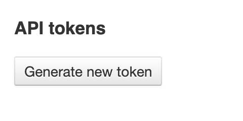

Import Data Using Python Script
+++++++++++++++++++++++++++++++

This page demonstrates how to use the python load&link script to input data into ODM. Please note that you need to be a member of the curator group in ODM to be able to import and edit data in ODM.

Requirements
------------

You need to have:

- The load&link python script itself (this will be provided soon or can be requested)

- A Genestack API token

- A Study file containing metadata about the study in CSV or TSV format, hosted at an FTP or HTTP web address

- A Samples file containing metadata about the samples in CSV or TSV format, hosted at an FTP or HTTP web address

Optional experimental (signal) data files
-----------------------------------------

You can optionally also provide:

- Expression data in GCT_ format, hosted at an FTP or HTTP web address

.. _GCT: https://software.broadinstitute.org/cancer/software/gsea/wiki/index.php/Data_formats#GCT:_Gene_Cluster_Text_file_format_.28.2A.gct.29

- Expression metadata in CSV or TSV format, hosted at an FTP or HTTP web address

- Variant data in VCF_ format, hosted at an FTP or HTTP web address

.. _VCF: https://samtools.github.io/hts-specs/VCFv4.2.pdf

- Variant metadata in CSV or TSV format, hosted at an FTP or HTTP web address

- Flow cytometry data in .facs format, hosted at an FTP or HTTP web address

- Flow cytometry metadata in CSV or TSV format, hosted at an FTP or HTTP web address

Once imported, studies, samples, and signal metadata will be queryable and editable from both the User Interface and
APIs, whilst the signal data will only queryable via APIs.

Getting a Genestack API token
-----------------------------

Before you begin you will need a genestack API token.

To obtain a token, sign in to ODM via a web browser, click on your email address in the top right and select "Profile"

.. image:: images/import_data_script_profile.png
   :scale: 50 %
   :align: center

Then click the "Generate new token" button under API tokens:

You will then be emailed a link to download your token as plain text. Use this token as required below.

Script usage
------------

Run the script by typing:

.. literalinclude:: import-data-script-1.py

Optionally include data files by appending any or all of the following to the above command:

.. literalinclude:: import-data-script-2.py

.. literalinclude:: import-data-script-3.py

.. literalinclude:: import-data-script-4.py

Example files
-------------

The following are some example files to illustrate file formats:

- `Test_1000g.study.tsv`_, a tab-delimited file of the study attributes

.. _`Test_1000g.study.tsv`: https://s3.amazonaws.com/bio-test-data/odm/Test_1000g/Test_1000g.study.tsv

- `Test_1000g.samples.tsv`_, a tab-delimited file of sample attributes.

.. _`Test_1000g.samples.tsv`: https://s3.amazonaws.com/bio-test-data/odm/Test_1000g/Test_1000g.samples.tsv

- `Test_1000g.gct`_, a GCT_ file of expression data from multiple sequencing runs

.. _`Test_1000g.gct`: https://s3.amazonaws.com/bio-test-data/odm/Test_1000g/Test_1000g.gct
.. _GCT: https://software.broadinstitute.org/cancer/software/gsea/wiki/index.php/Data_formats#GCT:_Gene_Cluster_Text_file_format_.28.2A.gct.29

- `Test_1000g.gct.tsv`_, a tab-separated file that describes the expression data

.. _Test_1000g.gct.tsv: https://s3.amazonaws.com/bio-test-data/odm/Test_1000g/Test_1000g.gct.tsv

- `Test_1000g.vcf`_, a VCF_ file of variant data from multiple sequencing runs

.. _`Test_1000g.vcf`: https://s3.amazonaws.com/bio-test-data/odm/Test_1000g/Test_1000g.vcf
.. _VCF: https://samtools.github.io/hts-specs/VCFv4.2.pdf

- `Test_1000g.vcf.tsv`_, a tab-separated file that describes the variant data

.. _Test_1000g.vcf.tsv: https://s3.amazonaws.com/bio-test-data/odm/Test_1000g/Test_1000g.vcf.tsv

Run the script with the above by typing the following (inserting your token instead of [token]):

.. literalinclude:: import-data-script-5.py
