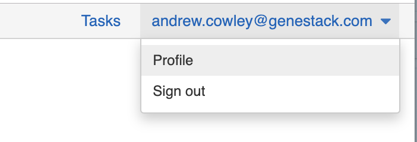

Import Data Using Python Script
+++++++++++++++++++++++++++++++

This page demonstrates how to use the python load&link script to input data
into ODM. Please note that you need to be a member of the curator group in ODM
to be able to import and edit data in ODM.

Requirements
------------

You need to have:

- The load&link python script itself (this will be provided soon or can be
  requested)
- A Genestack API token
- Either a Study file containing metadata about the study in TSV format, hosted
  at an HTTPS web address, OR the accession of an existing study in ODM that
  you will add files to.
- A Samples file containing metadata about the samples in TSV format, hosted at
  an HTTPS web address

Optional experimental (signal) data files
-----------------------------------------

You can optionally also provide:

- The accession of a template to validate against rather than the default. Use
  ``--template <ACCESSION>`` to specify.
- The server address if you want to apply the script to a different ODM server.
  Use ``--server <ADDRESS>`` to specify.
- Expression data in GCT_ format, hosted at an HTTPS web address
- Expression metadata in TSV format, hosted at an HTTPS web address
- Variant data in VCF_ format, hosted at an HTTPS web address
- Variant metadata in TSV format, hosted at an HTTPS web address
- Flow cytometry data in .facs format, hosted at an HTTPS web address
- Flow cytometry metadata in TSV format, hosted at an HTTPS web address
- A cross-reference mapping file, in TSV format, hosted at an HTTPS web
  address. You can also use ``--mapping_file_accession`` instead to specify a
  previously uploaded mapping file.
- A libraries file in TSV format, hosted at an HTTPS web address, or the
  accession of an existing library file
- A preparations file in TSV format, hosted at an HTTPS web address, or the
  accession of an existing preparations file.

Once imported, studies, samples, and signal metadata will be queryable and
editable from both the User Interface and APIs, whilst the signal data will
only queryable via APIs.

.. _VCF: https://samtools.github.io/hts-specs/VCFv4.2.pdf
.. _GCT: https://software.broadinstitute.org/cancer/software/gsea/wiki/index.php/Data_formats#GCT:_Gene_Cluster_Text_file_format_.28.2A.gct.29

Linking using sample source ID
------------------------------

By default linking is done via the **Sample Source ID** key, so this needs to
be consistent in the above files for linking to occur.

Getting a Genestack API token
-----------------------------

Before you begin you will need a genestack API token.

To obtain a token, sign in to ODM via a web browser, click on your email
address in the top right and select "Profile"

Then click the "Create new token" button under API tokens:

.. image:: images/odm_profile1.png
   :scale: 40 %
   :align: center

You will then be emailed a link to download your token as plain text. Use this token as required below.

Script usage
------------

Run the script by typing:

.. literalinclude:: import-data-script-1.py

Optionally include data files by appending any or all of the following to the above command:

.. literalinclude:: import-data-script-2.py

.. literalinclude:: import-data-script-3.py

.. literalinclude:: import-data-script-4.py

.. literalinclude:: import-data-script-6.py

.. literalinclude:: import-data-script-8.py

.. literalinclude:: import-data-script-9.py

Updating (signal) data files
----------------------------

To update a signal data file (e.g. GCT, VCF file) rather than adding another
data file, append the accession of the data file to be updated in square
brackets to the URL of the data file import. Existing study and sample
accessions must be supplied. See the example below:

.. literalinclude:: import-data-script-7.py

Example files
-------------

The following are some example files to illustrate file formats:

- `Test_1000g.study.tsv`_, a tab-delimited file of the study attributes
- `Test_1000g.samples.tsv`_, a tab-delimited file of sample attributes.
- `Test_1000g.gct`_, a GCT_ file of expression data from multiple sequencing runs
- `Test_1000g.gct.tsv`_, a tab-separated file that describes the expression data
- `Test_1000g.vcf`_, a VCF_ file of variant data from multiple sequencing runs
- `Test_1000g.vcf.tsv`_, a tab-separated file that describes the variant data

.. _GCT: https://software.broadinstitute.org/cancer/software/gsea/wiki/index.php/Data_formats#GCT:_Gene_Cluster_Text_file_format_.28.2A.gct.29
.. _Test_1000g.gct.tsv: https://s3.amazonaws.com/bio-test-data/odm/Test_1000g/Test_1000g.gct.tsv
.. _Test_1000g.vcf.tsv: https://s3.amazonaws.com/bio-test-data/odm/Test_1000g/Test_1000g.vcf.tsv
.. _VCF: https://samtools.github.io/hts-specs/VCFv4.2.pdf
.. _`Test_1000g.gct`: https://s3.amazonaws.com/bio-test-data/odm/Test_1000g/Test_1000g.gct
.. _`Test_1000g.samples.tsv`: https://s3.amazonaws.com/bio-test-data/odm/Test_1000g/Test_1000g.samples.tsv
.. _`Test_1000g.study.tsv`: https://s3.amazonaws.com/bio-test-data/odm/Test_1000g/Test_1000g.study.tsv
.. _`Test_1000g.vcf`: https://s3.amazonaws.com/bio-test-data/odm/Test_1000g/Test_1000g.vcf

Run the script with the above by typing the following (inserting your token
instead of [token], note you may need to escape or quote strings depending on
your specific command line interface):

.. literalinclude:: import-data-script-5.py
