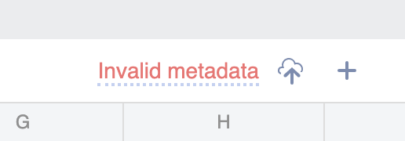
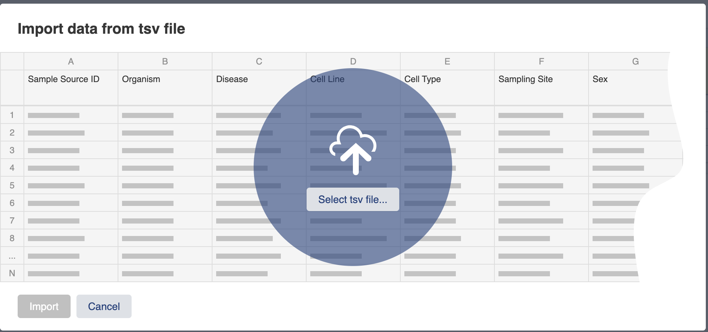
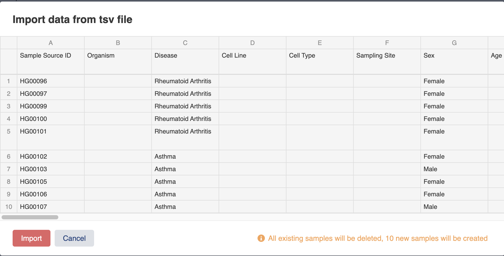
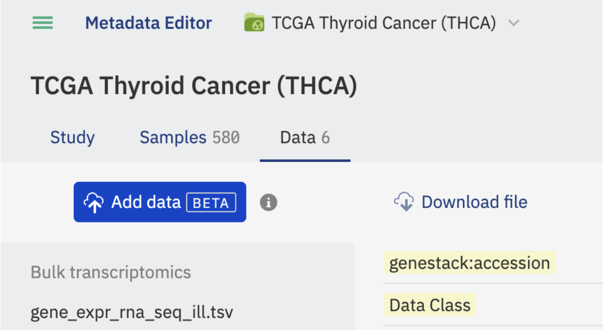

Import Data in ODM
++++++++++++++++++++++++++

This page offers a comprehensive guide to data importation in the Open Data Manager (ODM). Please note that importation and editing of data is exclusively available to members of the curator group in ODM.

What Can Be Imported?
---------------------

ODM supports the import of studies, samples, and data in tabular format, or the attachment of any file relevant to your study:

- *Study* descritption: This refers to the context of an experiment, including the aim and statistical design.
- *Sample* information (sometimes referred as Metadata): This pertains to the biological attributes of a sample, such as tissue type, disease, and treatment.
- *Data*: Includes transcriptomics, proteomics, gene variant, flow cytometry data, and more.
- *Files*: You can attach any file that is relevant to your study (reports, presentations, documents, images, scientific publications, etc.).
- *Libraries* and *Preparations*: These can only be uploaded via the API at present. GUI functionality will be introduced in future releases.

If your study doesn't already have samples metadata with linked data (for example you have just created a new study) it is possible to import a spreadsheet of samples metadata through the interface. This functionality is available in the Metadata Editor, on the samples tab.

The data uploading happens in Metadata Editor when you open (or create) a Study. 

Importing Sample Information (Metadata)
---------------------------------------

You need a study which has no previously uploaded sample information that is linked to data.

You need a TSV format file (with a filename extension of .tsv) containing sample information. The first row of the table is a list of the metadata attribute names, which must not be duplicated.
See the example below:

- `Test_1000g.samples.tsv`_, a tab-delimited file of sample attributes.

.. _`Test_1000g.samples.tsv`: https://s3.amazonaws.com/bio-test-data/odm/Test_1000g/Test_1000g.samples.tsv

+----------------------+------------------+--------------+-----+------------+
| Sample Source        | Sample Source ID | Species      | Sex | Population |
+======================+==================+==============+=====+============+
| 1000 Genomes Project |     HG00119      | Homo sapiens |  M  | British    |
+----------------------+------------------+--------------+-----+------------+
| 1001 Genomes Project |     HG00121      | Homo sapiens |  F  | British    |
+----------------------+------------------+--------------+-----+------------+
| 1002 Genomes Project |     HG00183      | Homo sapiens |  M  | Finnish    |
+----------------------+------------------+--------------+-----+------------+
| 1003 Genomes Project |     HG00176      | Homo sapiens |  F  | Finnish    |
+----------------------+------------------+--------------+-----+------------+

To import samples via the GUI you need to go to the Metadata Editor and then the samples tab. Each new study will be populated with some dummy sample entries but these will be deleted when you import a samples file.

Click on the cloud icon to the right of the samples tab:

This will open a dialogue box that prompts you to select a local TSV file.

Once you have selected a .tsv file a preview of the import is shown:

Click the Import button and the samples will now be visible in the samples tab. Any previous sample metadata will be deleted.

Import Data [BETA]
------------------

ODM enables you to add any data to your study. There are two main ways to associate a file related to your research:

- Import a Data Frame: Import data files in tabular format. ODM extracts pertinent information stored in your file (e.g., gene expression measurements, gene variants, pathway activity scores, metabolite abundance, sales data) and writes it in the ODM database to enable searchability.
- Attach a File: Add various research materials related to your study, such as PDF, XLSX, DOCX, PPTX, images, and more. All users with access to the study can download these attached files. However, unlike the "Import Data" option, attached files' content is not indexed or searchable.

.. note:: Data uploading through the user interface is currently in BETA stage. The current version supports file uploading of up to 5GB. Future releases will enhance its functionality and flexibility.

You can find a detailed description of the supported file formats :ref:`format-label`.

To add data, open a Study and navigate to the Data tab. Click the “Add data” button situated in the top left corner of the Data tab.

In the subsequent dialog window, several parameters need to be defined:

.. image:: images/define-your-data.png
   :scale: 50 %
   :align: center

**Choose Import or Attachment**: Select if you want to import your data or attach a file.

**Data Type (Data Class)**: Identify the data type you want to upload. Multiple types are supported:

- Bulk transcriptomics - Supports data provided in TSV or GCT 1.2 format.

- Single cell transcriptomics - Supports data provided in TSV format. Note: the support of the Single Cell data is limited in the BETA and the TSV uploading is recommended via the API specifying “Skip Zeros” parameter in the acttached metadata file.

- Differential abundance (FC, pval, etc.) - TSV format.

- Pathway analysis - TSV format.

- Proteomics - TSV format.

- Single cell proteomics - Supports data provided in TSV format. Note: the support of the Single Cell data is limited in the BETA and the TSV uploading is recommended via the API specifying “Skip Zeros” parameter in the acttached metadata file.

- Metabolomics - TSV format.

- Epigenomics - TSV format.

- DNA methylation - TSV format.

- Chemoinformatics - TSV format.

- Imaging features - TSV format.

- Gene panel data - TSV format.

- Biomarker data - TSV format.

- Physical measures - TSV format.

- Blood counts - TSV format.

- Other body fluid counts - TSV format.

- Nanopore - TSV format.

- Gene variant (VCF) - VCF format.

- Flow Cytometry - FCS format.

- Other - TSV format.

.. note:: In the BETA the list of the Data Type options is fixed. Make sure you chose the right data class for your dataset. The ability to add custom data classes as well as change the selected data class for the uploaded data will be added in future releases.

**Link With**: Choose the entity you wish to link your data to. For instance, if you're uploading a transcriptomics file with gene expression measurements for each sample, you should link your data to the samples. 

.. note:: In the BETA version, you need to have sample information (metadata) created/uploaded on the Samples tab to enable data import. If no Libraries or Preparations exist for the Study, 'Sample' is the only available option.

**Link By**: Choose the ID column at the Sample (Library, Preparation) tab that will be used to identify Sample (Library, Preparation) names in the uploaded file. 

.. note:: In the BETA version, the only option to link your data is through the 'Sample Source ID' column you must provide at the Sample (Library or Preparation tab). To link by any Sample/Library/Preparion metadata column, you'll need to use the API.

**Number of Feature Attributes**: If your file includes more than one column describing the feature, specify the number of such columns (you can find more information about this on the format description page). It's crucial to indicate the correct number of feature attributes to prevent potential issues during file upload.

**Advanced Options** - Allow Importing the Same File Twice: This option allows you to re-upload the same file from third-party storage platforms (like AWS S3) using the same link. If you're uploading the same file from your local computer, this option isn't necessary.

If your file includes more than one measurement per Sample (Library or Preparation), e.g., Fold Change and P-value, the system will automatically recognize it based on the following criteria:

- Measurement Separator Symbol in Column Name: Each column name should contain a symbol (or symbols combination), separating sample (library or preparation) name from measurement type, e.g., it would be a dot for 'Sample1.p-value'. If a column name has more than one measurement separator (for instance, 'Sample1.p.value'), the first one will be used for separation.
- Measurement Separator Symbol on upload request: The separator must be explicitly specified on data upload request either through API or GUI.
- Presence of Measurement Separator Symbol: Every column must include a measurement separator.
- Consistency of Measurement Types: All samples (libraries or preparations) must have the same types of measurements in the file. For example, if you have three samples and each has measurements for Intensity and Quality Pass, your file should have six columns named: 'Sample1.Intensity', 'Sample1.QualityPass', 'Sample2.Intensity', 'Sample2.QualityPass', 'Sample3.Intensity', 'Sample3.QualityPass'.

In the second step, you'll need to choose the file you wish to upload. There are two options:

- **Local Computer**: Select the file located on your computer. Please note: this option is only available if your ODM version is coupled with AWS S3 storage (provided by default). If this option isn't functioning properly, please get in touch with Genestack’s customer care team.

- **External Link**: Upload the file by supplying a link to the file’s location. Keep in mind that while this option is intended to support any external location, in its BETA version, it only supports links from AWS S3 storage. If you encounter any issues with this feature, please reach out to Genestack’s customer care team.

.. image:: images/import-data-from-file.png
   :scale: 50 %
   :align: center

Once the data is chosen, the upload will begin. The duration can vary from a few seconds to more, depending on the size of the original file.

After the upload completes, the corresponding data will be visible in the 'Data' tab. All files are grouped by the chosen 'Data Class' parameter on the left panel, which includes attached files as well.

After uploading, you can populate the corresponding file metadata, including the necessary details. Please note that each uploaded data file has five mandatory read-only fields that do not belong to your template:

- Genestack:accession
- Data Class
- Features (string)
- Features (numeric)
- Value (numeric)

These fields are implemented to make the content of these files visible and searchable for data science users. We advise against editing these fields in the template editor as it could render these files inaccessible.

If a file has issues that prevent ODM from processing it correctly, an error message detailing the problem will appear. Such issues are typically related to file format inconsistencies. For further assistance, refer to the :ref:`format-label` page or contact Genestack’s customer care team. Failed file uploads will be displayed for seven days before automatic deletion occurs. Future releases will include the feature to manually delete these files.
