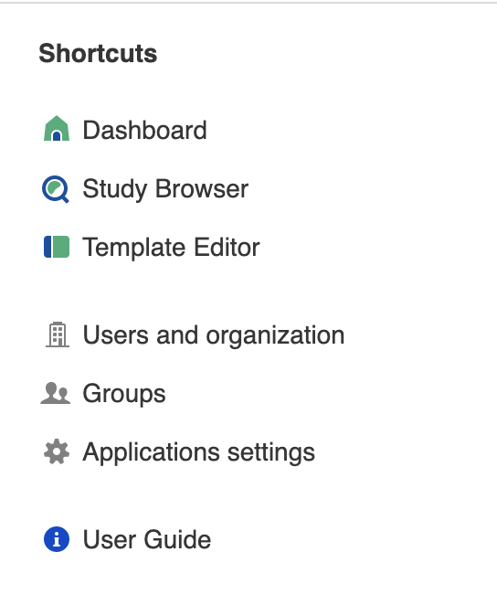
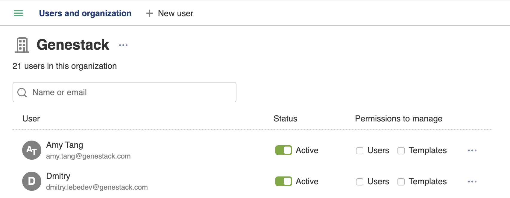
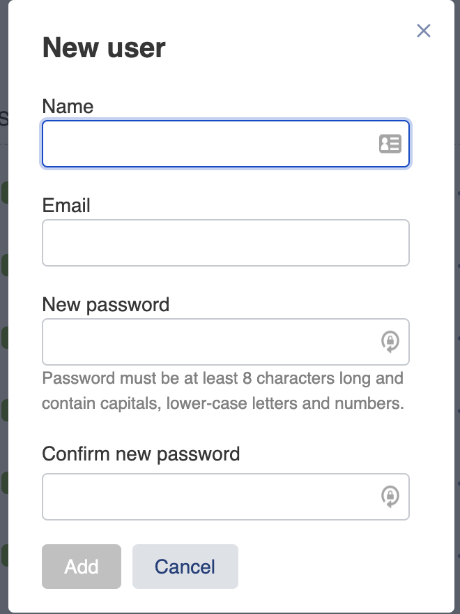

User setup
##########

Profile
*******

To explore and customize your account, click on your username (your email address)
in the top-right corner of the page and, then, select the menu item **Profile**.

.. image:: images/profile-1.png

On the opening page you'll find the following sections:

.. image:: images/odm_profile.png
   :scale: 45 %
   :align: center

- The first section contains your personal information, whether you are an admin and/or a curator user, which organisation you belong to and which groups you belong to. You can click the group name to taken directly to the group in the Manage Users application.

- The  **API tokens** section is where you can download an access-token which allows the use of scripts/APIs. Learn more about how to generate Genestack REST API tokens in the section :ref:`token-label`.

After you click **Generate new token** an email is sent to your email address. To generate the API token,
follow the link specified in the email. You can rename or delete previously generated tokens in your profile.

.. image:: images/token.png

- **Default landing page** section allows you to specify which window (Dashboard or Study Browser) should
  be your starting point when you sign in.

Users and organization
**********************

The **Users and organization** page allows you not only to get an overview of the existing users in your organisation,
but also to create new users and assign permission to manage templates. This page is accessible only if you are
an administrator of your organisation. You can check your role out in the **Profile**.

In order to open the application, you can use the shortcut menu and select **Users and organization**.

On the page you can change passwords of the users by clicking the three dots icon, control if the account is active, an admin user or has permission to edit and manage templates, including setting the default template.

To create a new user, click on the **Create user** button. In the pop-up window you should specify for
the new user their name, email and password.

After the user is created they can log in using the specified credentials.

Manage groups
*************

**Groups** are used to share files with other users, so that they are accessible for all members
of that group. Any user can create one or several groups and invite their collaborators.

Depending on a role a user have, they can have different privileges in sharing process and managing the group, namely:

- *Non-sharing* — can only view the files shared with the group, however they have no sharing permissions;
- *Sharing User* — not only have an access to the shared files but also can share data themselves;
- *Group Administrator* — in addition to the sharing user rights, can invite or remove users and change their privileges.
  By default, you'll be a group administrator of any group that is created by your user.

For more information on using groups and sharing files, see the section :ref:`sharing-label`.

**Manage groups** application lets you to view the list of groups you are invited in as well as their members,
and manage them according to your privileges.

Click **Manage groups** in the short-cut menu to navigate to the application page.

.. image:: images/shortcuts-manage-groups.png
   :scale: 70 %
   :align: center

If you are an administrator of your organisation, you'll see two groups automatically created for you:
one group lists all members of your organisation, another one — "Curator" group — includes those members which are
granted with additional permissions by the administrator of your organisation. All members of the "Curator" group
can approve and unapprove studies.

If you are not an administrator of your organisation, then, on the Manage Group page you'll see the group including
members of your organisation, their email addresses and roles.

.. image:: images/manage-groups-members&curator.png
   :scale: 40 %
   :align: center

Regardless your role in organisation, if you have no groups yet, you can create one by click **Create group**.
In the appeared pop-up window you'll be asked to give the group a name.

.. image:: images/create-group.png
   :scale: 40 %
   :align: center

As the new group is created, you can invite other users to join by click on **Add member**.
You can also delete the created group by click on **Remove group**.

.. image:: images/add-user.png
   :scale: 40 %
   :align: center

Then, in the dialog that appears, you'll be prompted for the new member email. If they are in your organisation,
you could take advantage of autocomplete.

.. image:: images/invite-by-email.png
   :scale: 40 %
   :align: center

If you would like to invite a collaborator from other organisation to join the group,
the invitation has to be approved by an organisation administrator from both sides.
To approve incoming invitations, you should go to the **Invitations** tab.

.. image:: images/invitations-tab.png
   :scale: 40 %
   :align: center

Once you have added a user to the newly created group, you'll also
be able to set up their permissions within the group (by default, new members are non-sharing users).

.. image:: images/change-permissions.png
   :scale: 80 %
   :align: center
