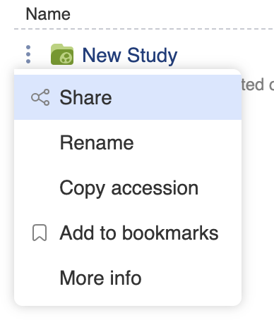
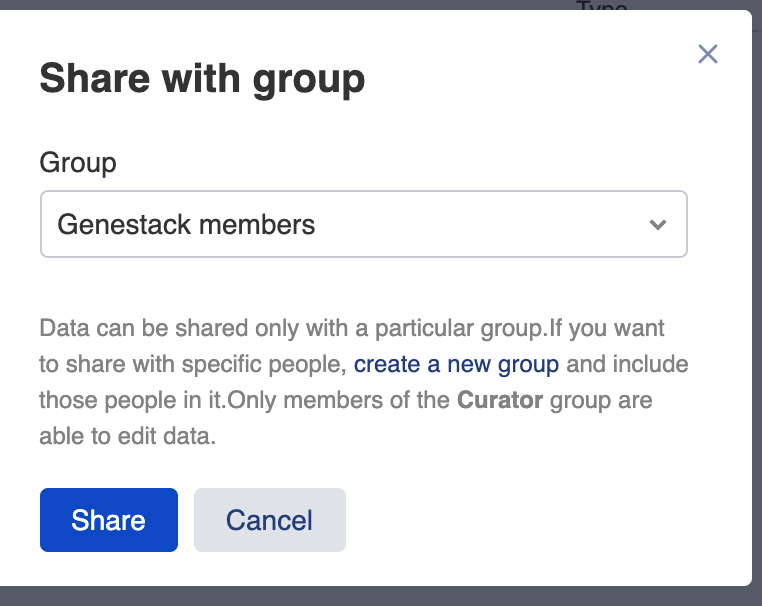
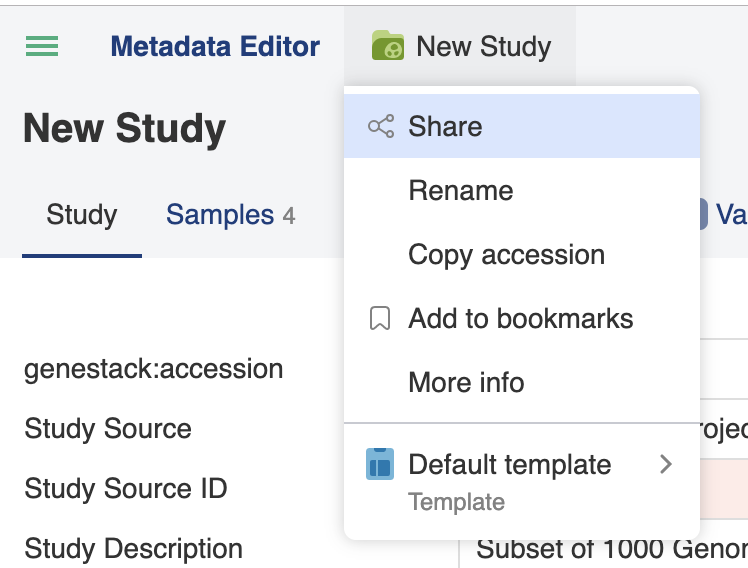

Sharing
+++++++

Sharing enables you to allow people in specific groups to view datasets that you upload (i.e. own), and is typically done once you have curated your study.

Sharing from the Study Browser
------------------------------

The three dot button next to any study name opens a menu which allows you to select **Share**.

You will be prompted to choose which group of users to share the study with, then click the **Share** button.

Members of this group will now be able to view this study using the **Shared with me** filter:

.. image:: images/shared_with_me.png
   :scale: 70 %
   :align: center

Sharing from the Metainfo Editor
--------------------------------

Sharing from the Metainfo Editor is similar to the above, except that to access the sharing menu you must click on the name of the study/folder icon at the top of the page:

