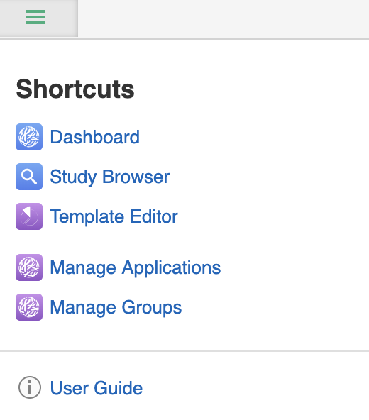
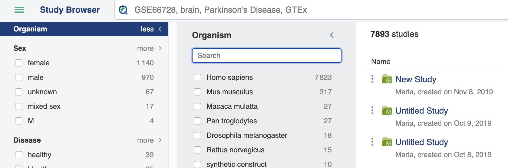
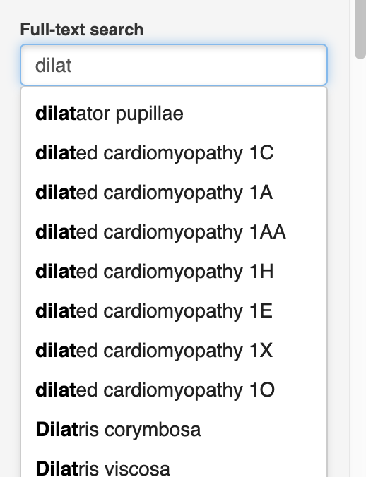
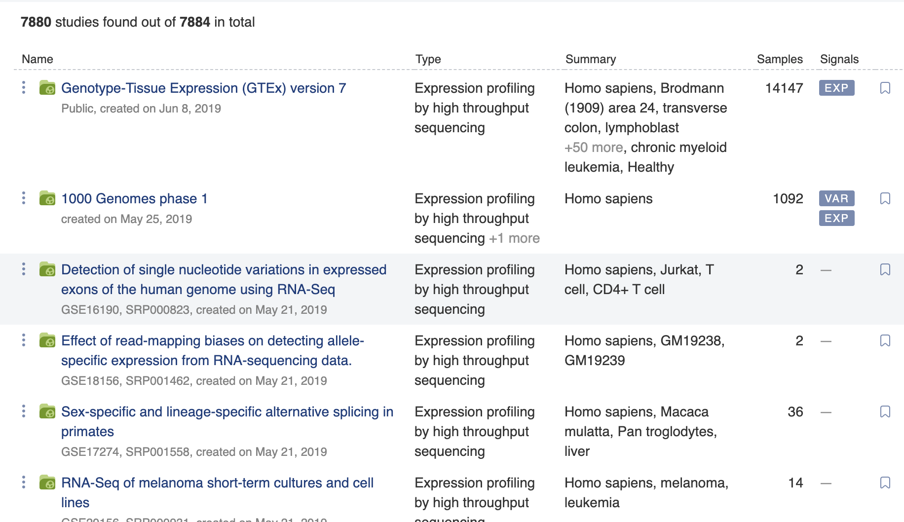
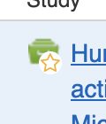
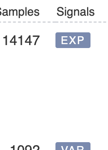

Study Browser
+++++++++++++

The Study Browser is the main interface to quickly search and discover studies of interest.

Getting to the Study Browser
----------------------------
Click 'Browse studies' on the dashboard after you sign in to launch the Study Browser.

.. image:: images/quickstart_user_dashboard.png
   :scale: 35 %
   :align: center

You can also use the short cut dock in the top lefthand corner of any window.

Exploring the Study Browser
***************************

.. image:: images/quickstart_user_studybrowser.png
   :scale: 35 %
   :align: center

The panel down the left-hand side gives you the option to search and filter the results. 

The main panel displays the results of your search and filter options, if you have any, otherwise all studies are displayed that your user account has visibility of, ordered by date with the newest at the top.

Search panel
------------

The search panel consists of a full-text search box and several faceting options to filter down results.

In the text box you can search by the name of a study, the accession of a study, sample or signal object, or by any text that is in any metadata field across all of the data you have visibility of.

As you begin typing you will be offered auto-complete suggestions based on dictionaries of terms that are present in ODM.

These dictionaries are controlled vocabularies or ontologies, and they are one of the keys to making data in ODM 'FAIR', that is: Findable, Accessible, Interoperable and Reuseable.

The search is synonym-aware, so if you type in 'human' the auto-complete suggests 'Homo sapiens' as the preferred label of humans.

Underneath the search box there are filters for study ownership so you can quickly filter down to say, public, data, and filters for which signal types you wish to be present in your studies.

Beneath that are further facets based on the metadata values that are present in ODM - grouped into Study, Samples and then the individual Signal types.

Exactly which metadata fields are available as search facets is determined by templates, which is also how you specify what metadata are expected to be seen for a given type of omics data, and which controlled vocabularies or ontologies should apply. 

Results panel
-------------

The main panel in the study browser shows the results of your search, or if no search terms/filters have been applied, all studies that you have visibility of. The first column displays the name of the study, and you can click this to look at the study in more detail. It also lists information about which user created or imported the study, and the date.

If you hover over the file icon you can also see a small star - you can click this to bookmark a favourite study both to highlight the icon and to enable quick recall at a later date using the 'only bookmarks' option.

The next column shows the type of the study. If there is information about the general type of study, for example: 'expression profiling by high throughput sequencing', or 'RNA-seq of coding RNA from Single Cells' then it is displayed here. 

The third column is a summary of the metadata that is associated with the study. This displays information such as the organism, tissue, cell-type, disease and so on and is pulled straight from the metadata fields of the samples in the study.

You can hover over any name in the summary column and the name of the metadata field where the data comes from will appear.

.. image:: images/studybrowser_tooltip.png
   :scale: 35 %
   :align: center

The next column tells us how many samples are present in each study.

The final column shows what types of experimental signal data are present for each study. 

