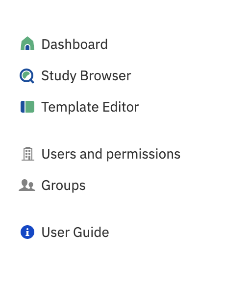
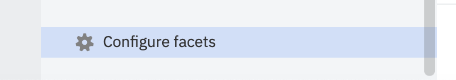
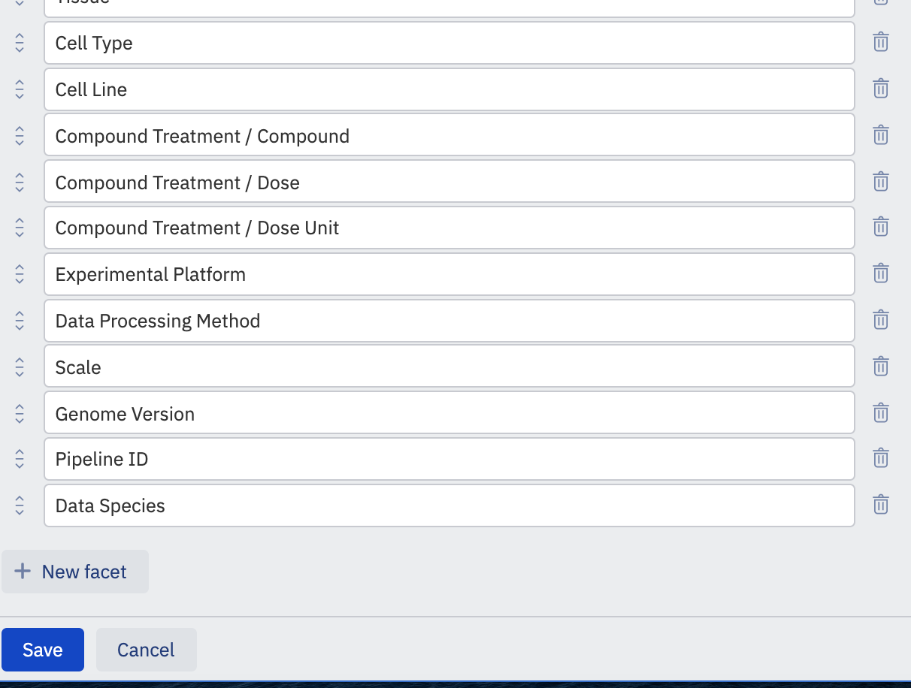
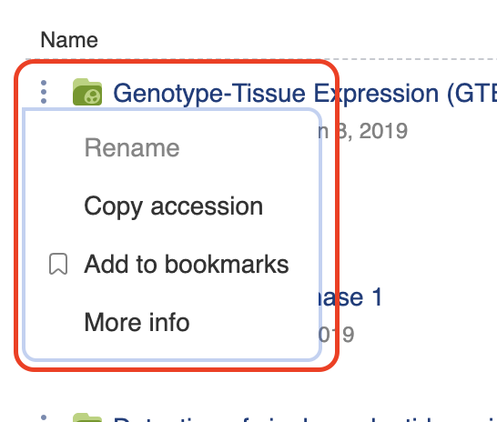

Study Browser
+++++++++++++

The Study Browser is the main interface to quickly search and discover studies of interest.

Getting to the Study Browser
----------------------------
Click 'Browse studies' on the dashboard after you sign in to launch the Study Browser.

.. image:: images/quickstart_user_dashboard.png
   :scale: 35 %
   :align: center

You can also use the short cut dock in the top lefthand corner of any window.

Exploring the Study Browser
---------------------------

.. image:: images/quickstart_user_studybrowser.png
   :scale: 35 %
   :align: center

At the top of the window is the main search bar. In the text box you can search by the name of a study,
the accession of a study, sample or signal object, or by any text that is in any metadata field across
all of the data you have visibility of. As you begin typing you will be offered auto-complete suggestions
based on dictionaries of terms that are present in ODM.

The search is synonym-aware (exact and related), so if you type in 'human' the auto-complete suggests 'Homo sapiens' as the preferred label of humans and the results from synonyms are automatically included in search results.

Question marks (?) match any character, and you can use asterisks (*) to allow any number of (including zero) wildcard characters: *ale will find "male" and "female" for example. Use quotes (“”) to search for an exact phrase. For example, “single cell” will find results that contain the whole phrase only.

Terms can be joined with the AND operator (by default the OR operator is used), and they can be excluded with a preceding NOT.

The main panel displays the results of your search and filter options, if you have any,
otherwise all studies are displayed that your user account has visibility of,
ordered by date with the newest at the top.

If your search term matches a term from an ontology which has child terms, then once initial results have been retrieved there is the option to toggle 'extend query', which will add search results for child terms (those with the subClassOf property in the ontology). This is only available if the number of terms (including synonyms) is fewer than 30,000.

Filter panel
************

The filter panel allows you to filter your results with search facets. Set facets to refine search results. Facets are
automatically generated from the metadata of available datasets, and the suggested list of facets varies
depending on a search results. Click 'More' to explore the whole list of suggested items.

.. image:: images/studybrowser_searchpanel.png
   :scale: 35 %
   :align: center

Bookmarked studies can be shown by clicking on the Bookmarks icon. Access allows you to see your studies, those that are accessible to you (for example, public studies) or those that have been shared with your user account/group.

If there are additional facet terms a **Find more** link will be displayed.
Clicking on this allows you to type in terms and you can select from the presented list of options.

.. image:: images/studybrowser_autocomplete.png
   :scale: 35 %
   :align: center

Configuring the filter panel
****************************

Exactly which metadata fields are available as search facets can be configured by users who have the permission to configure facets. To change the facets click the cog icon at the bottom of the filter panel.

You can add facets to the filter panel by clicking the **New facet** button and typing the full name of the metadata field which you want to appear. Names are case sensitive. You can also reorder the facets by dragging the icon next to the facet name, or delete them from the panel by clicking the bin icon. Once you are happy click the **Save** button to apply the changes. If your facet is empty or a duplicate it will not be allowed and the panel change won't save until this is corrected.

Results panel
*************

.. image:: images/quickstart_user_studybrowser.png
   :scale: 35 %
   :align: center

The main panel in the study browser shows the results of your search, or if no search terms/filters have been applied, all studies that you have visibility of. The first column displays the name of the study, and you can click this to look at the study in more detail. It also lists information about which user created or imported the study, and the date.

To the left of the study titles is a three dot link. Click this to open a menu that allows you to share the study (if you have permission), export data, copy the accession of the study, add it to your bookmarks, or view more information.

Under the study title there is a summary of the metadata that is associated with the study. This displays information such as the organism, tissue, cell-type, disease and so on and is pulled straight from the metadata fields of the samples in the study.

You can hover over any name in the summary column and the name of the metadata field where the data comes from will appear.

.. image:: images/studybrowser_tooltip.png
   :scale: 50 %
   :align: center

There is also information of who imported the study into ODM and when.
To the right of the study title you can see how many samples are present in the study.

And finally you can use the bookmark flag at the end to flag studies for viewing later.
