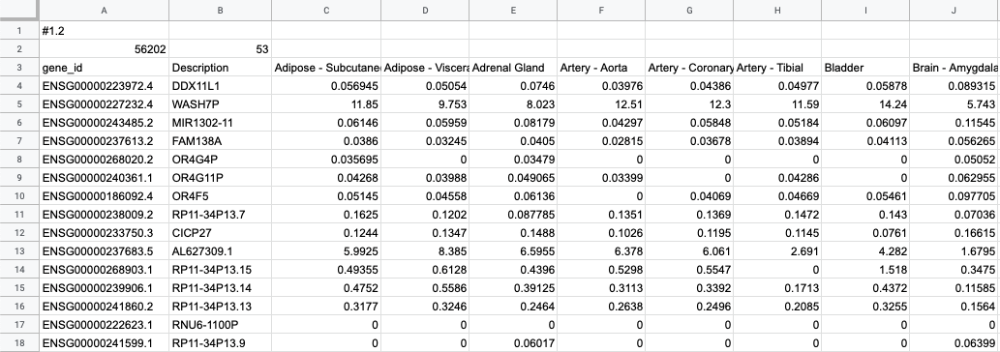
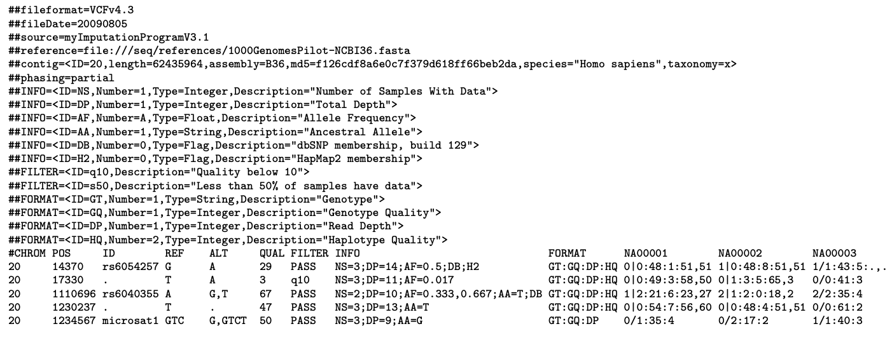
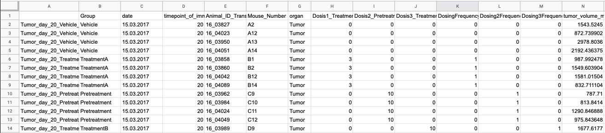
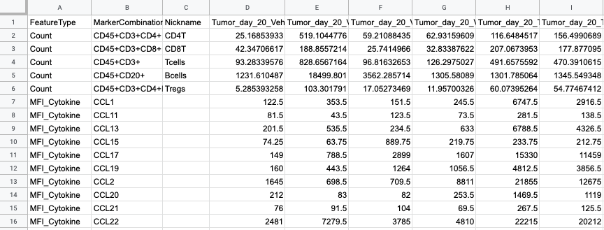

Supported File Formats
++++++++++++++++++++++

Expression data (transcriptomics)
---------------------------------

**GCT (Gene Cluster Text, .gct)** data files are supported by ODM. This is a tab-delimited text file describing a gene expression dataset (e.g. microarray, RNA-seq data). GCT files are automatically recognised as Expression files in ODM.

The first line contains the file version and for gct format is always: #1.2

The second line shows the number of rows (‘56202’) and columns (‘2’) of the expression matrix, excluding the identifier and description columns.

The third line contains headers for the identifier column (first), description (second) and sample metadata (remainder) labels, which must all be unique. For example: ‘gene_id’, ‘Description’, ‘Bladder’.

Below the header row is the data matrix. The first column contains the unique identifier values (e.g. Ensembl gene ID), the second column has a text description, the remaining columns contain values for the assay that was carried out (for example intensity of a sample gene expression measured in a specific tissue);

In the data matrix there is a row for each gene, and a column for each sample. The number of rows and columns should agree with the rows and columns specified on row two of the file.

Names and descriptions may contain spaces, but may not contain nothing - NA or NULL text strings should be used.

Intensity values in the data matrix can be left empty if they are missing.

To learn more take a look at the GCT specification_.

.. _specification: http://software.broadinstitute.org/cancer/software/genepattern/gp_guides/file-formats/sections/gct

.. [broken link; another option => https://software.broadinstitute.org/software/igv/GCT]

- `Test_1000g.gct`_, an example GCT file

.. _`Test_1000g.gct`: https://s3.amazonaws.com/bio-test-data/odm/Test_1000g/Test_1000g.gct

**.gct.tsv** files are tab delimited files that contain text metadata that describes the expression data, e.g. normalisation method, genome version.  The first row contains the key names, the second row contains the values.

+----------------------+----------------------+-----------------+
| Expression Source    | Normalization Method | Genome Version  |
+======================+======================+=================+
| 1000 Genomes Project |         RPKM         | GRCh38.91       |
+----------------------+----------------------+-----------------+

- `Test_1000g.gct.tsv`_, an example expression metadata file

.. _Test_1000g.gct.tsv: https://s3.amazonaws.com/bio-test-data/odm/Test_1000g/Test_1000g.gct.tsv

Variant data (genomics)
-----------------------

ODM accepts **VCF files(Variant Call Format, .vcf)** for variant Data. VCF files are tab-delimited text files containing information about the position of genetic variations in the genome, and are produced as output of variant calling analysis.

Basic structure of a VCF file
*****************************

A VCF file contains three main parts:

- *Meta-information lines* (marked with “##”) — includes VCF format version number (##fileformat=VCFv4.3);
- *FILTER lines* (filters applied to the data, e.g. ##FILTER=<ID=LowQual, Description="Low quality">” ), FORMAT and INFO lines (explanations for abbreviations in the FORMAT and INFO columns of data lines,  e.g. “##FORMAT=<ID=GT,Number=1,Type=String,Description="Genotype">”);
- A wcf*Header line* (marked with “#”) — includes eight mandatory columns, namely #CHROM (chromosome), POS (genomic position), ID (identifier), REF (reference allele), ALT (alternate allele(s)), QUAL (Phred-scaled quality score for ALT), FILTER (filter status, where “PASS” means that this position has passed all filters), INFO (additional information described in the header lines, e.g. “DP=100”);
- *Data lines* — provide information about a genomic position of a variation and genotype information on samples for each position; each line represents a single variant, represented in the header.

Meta-information lines
======================

File meta-information is included after the ## string and must be key=value pairs. It is strongly encouraged that information lines describing the INFO, FILTER and FORMAT entries used in the body of the VCF file be included in the meta-information section. Although they are optional, if these lines are present then they must be completely well-formed.

Header line syntax
==================

The header line names the 8 fixed, mandatory columns. These columns are as follows:

1. #CHROM
2. POS
3. ID
4. REF
5. ALT
6. QUAL
7. FILTER
8. INFO

If genotype data is present in the file, these are followed by a FORMAT column header, then an arbitrary number of sample IDs. Duplicate sample IDs are not allowed. The header line is tab-delimited.

Data lines
==========

Fixed fields:

To learn more take a look at the VCF specification_.

.. _VCF specification: https://samtools.github.io/hts-specs/VCFv4.3.pdf

Flow cytometry data
-------------------

**FACS (.facs)** file is a TXT file with tab-delimited table that stores quantification data for proteins.

Annotation Table
****************

Annotation table file is tab-delimited table. Each row is one sample, each column is one property type (first column contains unique identifiers of each sample).

Signal Table
************

Tab-delimited file, where first columns describe features; then, each column corresponds to one sample.

Each row in the file is one feature:

- *Cytokine MFI* —  just one protein identifier. MFI = Mean/Median Fluorescence Intensity.
- *Cell counts* — a combination of cell markers (=genes/proteins) and modifiers: positive (+), negative (-), high(hi), low(lo), intermediate(int).
- *MFI_CellMarker* — like counts, but the intensity of one particular cell marker on a given cell subpopulation defines as for counts is measured.
- *Percentage* — like counts, but the percentage of cells positive/negative for a particular cell marker relative to the parent population as defined like for cell counts is provided.

Cell populations can have nicknames, e.g. CD45+CD3+CD4+FOXP3+ (’MarkerCombination’) cells are also called Tregs.
