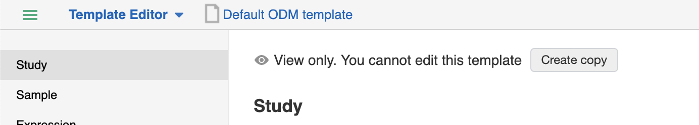

Template Editor
###############

The Template Editor application allows you to create, customize, and update templates for data import/validation.

How to access the application?
------------------------------

To get started, click **Set up templates** on the Dashboard:

.. image:: images/set-up-templates.png
   :scale: 30 %
   :align: center

Or use the short-cut dock and select **Template Editor**:

.. image:: images/shortcuts-template-editor.png
   :scale: 45 %
   :align: center

On the application page you will see the available import templates. Also, you can find out by whom and when it was
created, updated. Click on the template name to explore it in more detail.

.. image:: images/templates-list.png
   :scale: 70 %
   :align: center

What is the import template?
----------------------------

Import templates contain metadata attributes that should be associated with a file being imported.
A separate template is created for each supported file type, namely "Study", "Sample", "Expression", "Variant"
and "Flow cytometry", and includes metadata fields that can be used in the subsequent curation process.

Regardless the filetype the import template includes the following metadata fields:

- *Name* — name of metadata field that should be included in the metainfo (e.g. "Accession", "Organism");
- *Required* — determines whether the metadata field should be mandatory or not; if a field is marked as required
  and is left blank or it is incorrectly filled in, it is highlighted in red;
- *Metainfo type* — indicates metadata type for the filed, namely: text, integer, decimal, date, yes/no and external link;
- *Single* — indicates if several values can be added to a given field;
- *Read-only* — represents permissions for editing, where "yes" means that you cannot edit; the metadata
- *Dictionary* — allows you to specify a dictionary providing standardized and unified terms that can be used in data
  curation and to help validate and harmonise metadata.

.. image:: images/template-example.png
   :scale: 75 %
   :align: center

Create and edit import template
-------------------------------

Click on the template name and, then, select **Make a copy** to create your own editable copy of a template and modify it if needed.

Autocomplete can help you to specify an appropriate dictionary term to be used in metadata validation in the Metainfo Editor.

.. image:: images/edit-template.png
   :align: center

Change import template
----------------------

By default data is imported with the **Default Template**, which includes metadata
columns along with associated controlled dictionaries and ontologies. Feel free to change template in the **Metainfo Editor**
when editing metadata.

From the **Metainfo Editor**, click the study name, then **Apply another** and select
the template of interest from the list of suggested files. Click **Explore** to open it with the Template Editor.

.. image:: images/change-template-me.png
   :scale: 40 %
   :align: center