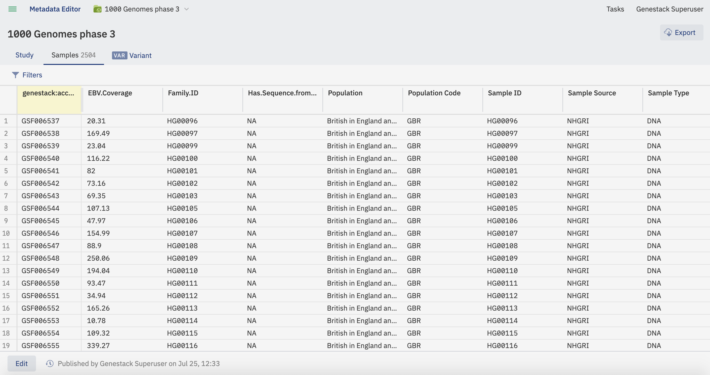
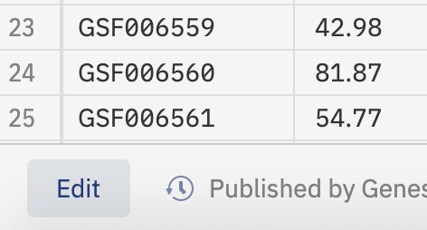
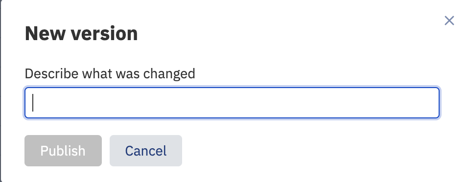
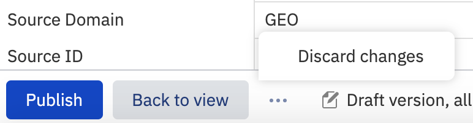
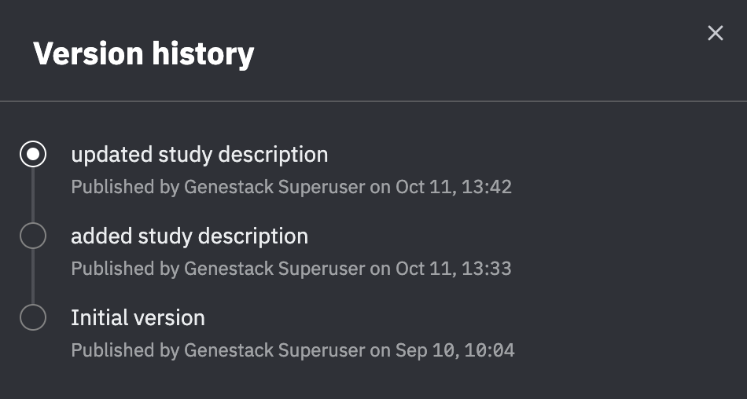
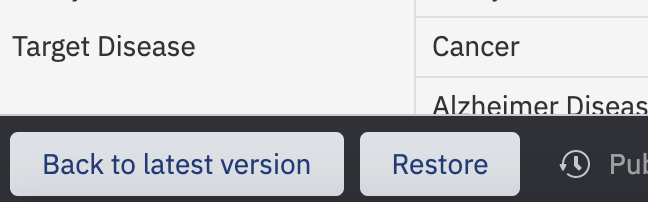

Metadata Versioning
+++++++++++++++++++

Metadata versioning is a feature which improves the curation experience when enabled on an ODM instance.

Metadata Editor View and Edit modes
-----------------------------------

With the versioning feature enabled the Metadata Editor now has two modes: View and Edit.

In the View mode changes to the metadata cannot be made, and the samples table allows more samples to be viewed without pagination.

To change to Edit mode (curators only) click the **Edit** button in the bottom left of the Metadata Editor tab.

Edit mode allows curators to change the metadata. Changes are saved on the fly but held in a draft (unpublished) copy until a new version is created by publishing. If a tab contains unpublished metadata it is marked with a blue dot. Only curators can see unpublished metadata, non-curators will continue to see the most recently published version though they can view previous versions and the change history by clicking on the clock icon.

.. image:: images/versioning-pending-tabs.png
   :scale: 35 %
   :align: center

Publishing a new version of metadata
------------------------------------

When a curator publishes a metadata tab they create a new version of the metadata and are prompted to include a description of the changes.

Note publishing only publishes pending changes on the current tab (Study, Samples etc.).

Discarding unpublished changes
------------------------------

After changes have been made but before they have been published it is possible to discard the draft copy by clicking on the three dot menu at the bottom of the screen and selecting **Discard changes**.

Viewing change history and restoring previous versions
------------------------------------------------------

To view and optionally restore (if a curator user) previous versions, first click on the clock icon in the bottom left of a metadata tab:

This displays a list of versions and change descriptions.

To restore a previous version first select it from this list. The metadata in the Metadata Editor will change to display the metadata from the selected version. If you wish to continue to restore this version click the **Restore** button at the bottom of the page. If you instead wish to cancel the restoration and go back to the latest published version, click **Back to latest version**.

Restoring a previous version does not delete subsequent versions but instead creates a new latest version as a copy of the version you are restoring.

Adding/deleting/importing sample objects
----------------------------------------

Using the buttons in the Metadata Editor to create new samples, delete sample rows, or import a samples table from a local file, all result in unpublished changes being made, so curators need to publish as above for non-curators to see the changes. These changes to sample objects can similarly be reverted via the restore previous version methodology above.

Exporting data
--------------

Exporting data only exports the latest published version and does not include any pending changes.
